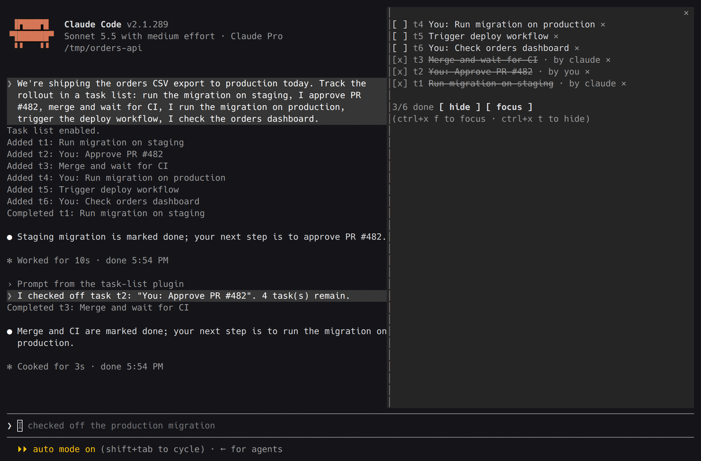
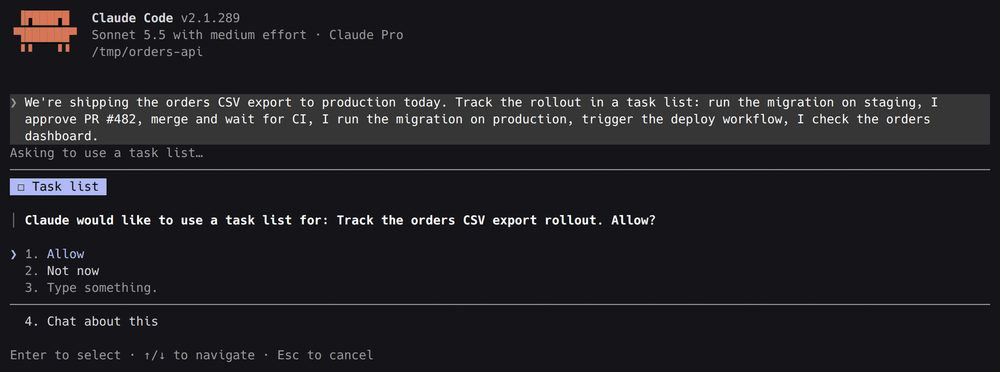
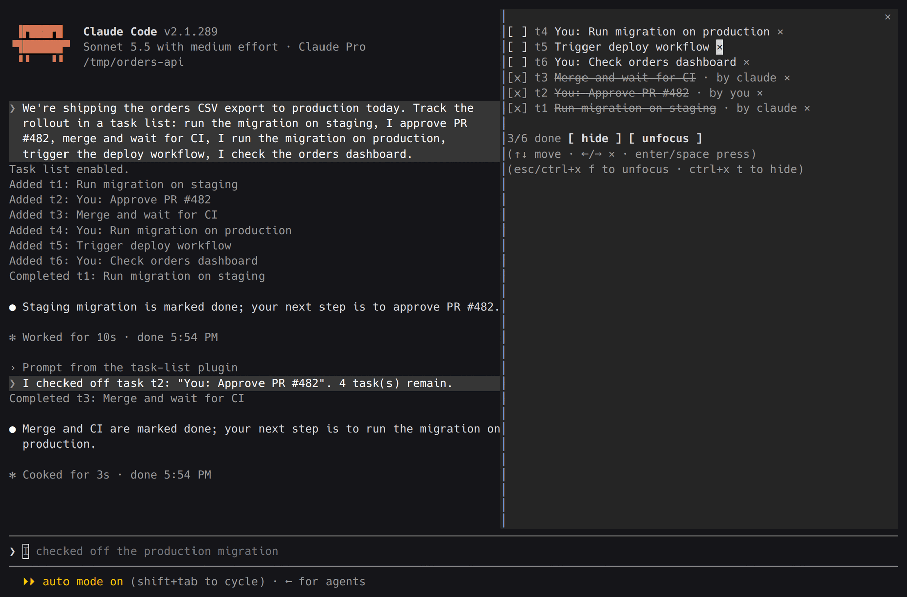
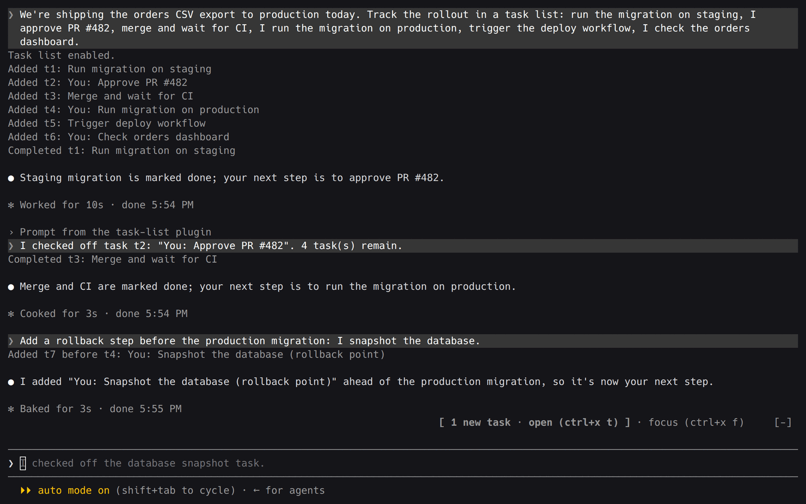
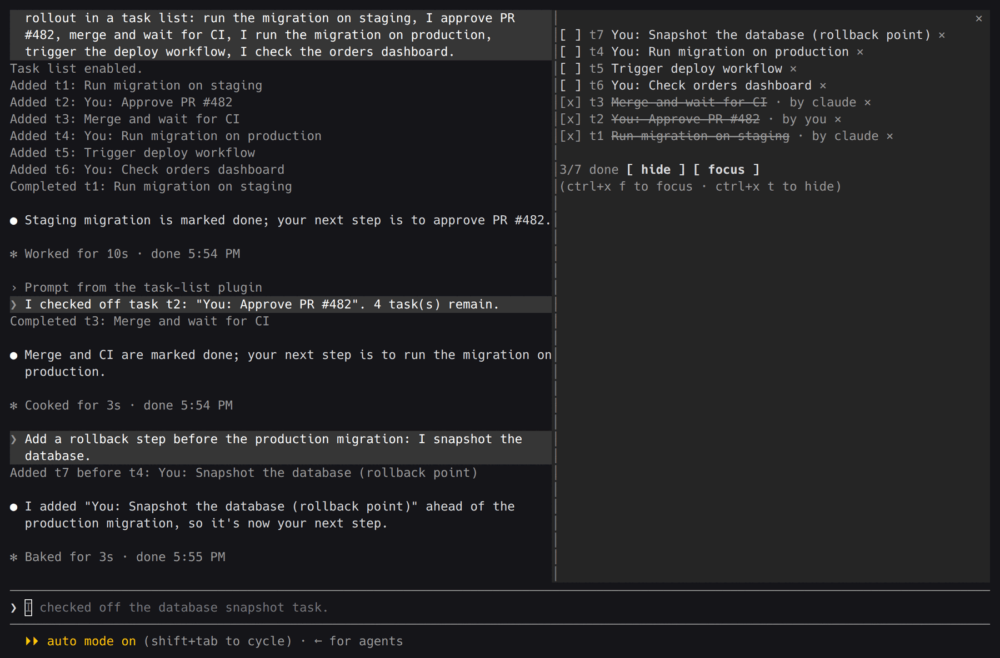

# claude-task-list

A shared, ordered task list for Claude Code. It sits in a pane beside the
chat: the agent keeps its steps there, you check off yours, and each of you is
told what the other did. It is opt-in, kept per project, and survives restarts.



## The problem

Some jobs are a sequence of steps that you and the agent share. The agent can
write the migration and open the pull request; you approve it. It can merge and
watch CI; you run the migration on production. It triggers the deploy; you
check the dashboard. That is the normal shape of work that touches production,
cloud infrastructure or CI/CD: some steps are yours because they need your
access or your judgement, and the order matters.

In a chat, that plan has nowhere to live:

- **It scrolls away.** The agent prints the plan once, then tool output buries
  it. To find out what is next, and whose move it is, you scroll back or ask
  the agent to summarise again.
- **Your steps are invisible.** When you finish yours, nothing records it. You
  have to say so in prose and hope the agent's picture of the plan follows.
- **It is not yours to control.** A list the agent starts whenever it likes is
  noise on small jobs, and one it can wipe is not a record.

## What this does

- **One plan, always in view.** The steps live in a pane, in the order they
  should happen. The agent is told to keep progress there and stop reprinting
  it in chat.
- **Both of you work the same list.** The agent completes its steps; you check
  off yours with a click, the keyboard or a `/tasklist` command. You can also
  reopen a step or delete one.
- **Each side hears about the other.** A step you check off reaches the agent
  at once, mid-turn if it is working, so it can carry on without you typing a
  prompt. Each row shows who completed it.
- **The order can change.** The agent can insert a step ahead of another when
  the plan changes ("snapshot the database before the production migration").
- **You are in charge of it.** The agent may ask to use a list and may ask to
  clear it; only you can turn it on, clear it, hide it or turn it off.
- **It persists per project.** Each project root has its own list, kept across
  restarts and `--continue`.

## Install

One line in a terminal:

```sh
claude plugin marketplace add reecelikesramen/claude-task-list && claude plugin install task-list@task-list
```

Or from inside Claude Code:

```
/plugin marketplace add reecelikesramen/claude-task-list
/plugin install task-list@task-list
```

Then, in Claude Code:

```
/tasklist keys install    add the hotkeys to your keybindings.json (optional)
/tasklist                 turn the list on
```

It needs a Claude Code build that loads function-hook plugins. That feature is
still rolling out: if `/tasklist` is not a command after installing, your build
does not have it yet. Built and tried on 2.1.288 and 2.1.289 in the terminal;
the pane is written to draw in the desktop app's Code tab too, where the two
chords do not apply.

## Using it

Turn it on with `/tasklist`, or let the agent ask: it gets a tool that raises
a dialog, and a dismissal counts as "no".



The pane lists open tasks first, then completed ones, dim and struck through,
the latest completed first. Each row shows the task's id (`t1`, `t2`, ...), so
when the agent mentions a task in chat you can find its row.

| To | Mouse | Keyboard (pane focused) | Command |
|---|---|---|---|
| Check or uncheck a task | click `[ ]` | Enter or space on it | `/tasklist check 3`, `/tasklist uncheck 3` |
| Delete a task | click `×` | right arrow, then Enter | `/tasklist remove 3` |
| Hide or show the pane | click `[ hide ]` | `ctrl+x t` | `/tasklist` |
| Give the pane the keyboard | click in it | `ctrl+x f` | `/tasklist focus` |

With the keyboard in the pane, the arrows move between tasks and to a row's
`×`; the footer shows the keys that work at that moment.



While the pane is hidden, a dim `tasks 2/5` above the prompt opens it. In
fullscreen, a task the agent adds while the pane is hidden raises a
`[ 1 new task · open ]` button there for ten seconds.



Shown again, the list has the new step where it belongs in the order.



### Keys

Claude Code does not let a plugin ship key bindings, so they are yours to add:
`/tasklist keys` lists them and says which are in place, and
`/tasklist keys install` adds the missing ones to your `keybindings.json`. A key
you already use for something else is left alone.

| Key | Where | Does |
|---|---|---|
| `ctrl+x t` | anywhere | Show or hide the pane. It comes back focused only if it was focused when hidden. |
| `ctrl+x f` | anywhere | Give the pane the keyboard (showing it first), or hand it back. |
| up, down, Tab | pane | Move between checkboxes. |
| right, left | pane | Move to the row's `×`, and back to its checkbox. In the footer, between `hide` and `focus`. |
| Enter, space | pane | Press. |
| Esc | pane | Back to the prompt. |

The pane and the band show the keys as you have them bound, so rebinding one
in `keybindings.json` changes the hint. By hand, the bindings are:

```json
{
  "bindings": [
    { "context": "Global", "bindings": { "ctrl+x t": "app:toggleReplTab", "ctrl+x f": "app:toggleDiffNoiseFilter" } },
    { "context": "Pane", "bindings": { "right": "pane:bottom", "left": "pane:top", "space": "abovePrompt:press" } }
  ]
}
```

These borrow actions Claude Code already has, because a plugin cannot define
its own: the two chords use engine actions with no default key (inside the
diff panel `ctrl+x f` keeps its own meaning there), and left and right use the
pane's Home and End scroll actions, so Home and End do the same thing.

### Commands

| Command | Effect |
|---|---|
| `/tasklist` | Turn it on when off; otherwise show or hide the pane |
| `/tasklist on` | Enable the list and open its pane |
| `/tasklist off` | Disable it and delete the saved list |
| `/tasklist clear` | Empty the list, stay on |
| `/tasklist hide` / `show` | Hide or show the pane; the list stays active |
| `/tasklist focus` | Show the pane and give it the keyboard |
| `/tasklist check <id>` / `uncheck <id>` | Check a task off, or reopen it (`7` is `t7`) |
| `/tasklist remove <id>` | Delete a task |
| `/tasklist keys` / `keys install` | List the key bindings; add the missing ones |

`/tasks` is a Claude Code built-in, hence `/tasklist`. The command runs at
once even while the agent is working.

### Settings

Set in `/config`, or under `pluginConfigs` in `settings.json`:

| Setting | Default | Effect |
|---|---|---|
| `paneWidth` | `0` | Columns the pane asks for when docked beside the transcript; `0` leaves it to Claude Code. A width you drag the pane to wins. |
| `maxCompleted` | `5` | How many of the most recently completed tasks the pane lists (`+3 more done` counts the rest); `0` hides completed tasks. |

## How it works

The agent gets two tools:

- `task_list_request` (`reason?`) asks you, in a dialog, to turn the list on.
- `task_update` (`action`: `add` | `complete` | `remove` | `list` |
  `request_clear`, plus `id` / `text` / `before`) edits the list once it is
  on. `add` with `before` inserts a step ahead of another. `request_clear`
  asks you; nothing lets the agent clear, hide or disable it.

While the list is on, a system prompt section tells the agent to track
progress there, and to name a task by its id and a few words of its text.
While it is off, nothing is added to the prompt. Each tool call is drawn as one
dim line in the transcript (`Added t1: ...`).

What you do to the list reaches the agent as a short notice. If the agent is
idle the notice starts a turn, shown in the transcript as one line of yours
(`I checked off task t3: "..."`); if it is working, the notice is attached to
its next tool result, or sent when the turn ends.

The list is stored under `task-list:<project root>` in the plugin's own store
in your Claude Code config directory.

## Developing

```sh
git clone https://github.com/reecelikesramen/claude-task-list
cd claude-task-list
claude --plugin-dir .      # load it in a session; edits reload on save
claude plugin validate .
claude plugin test .
```
